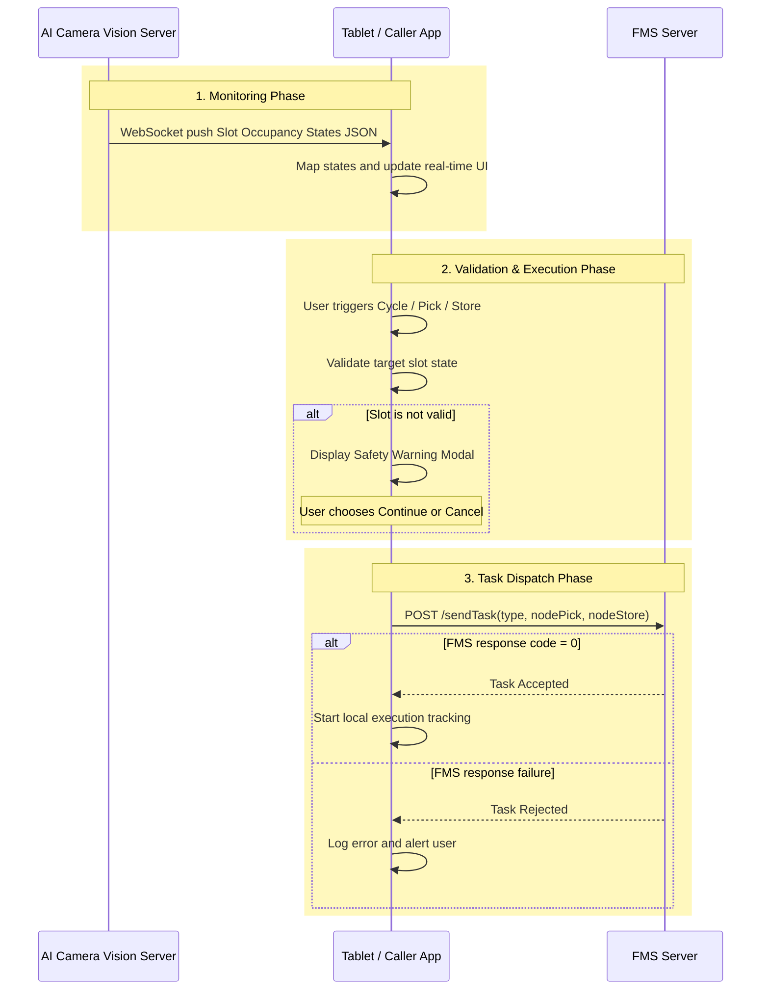

# System Architecture

# 0. MAIN CONCEPT PROCESS

Đây là process chính thức cần bám sát trong HAMAS25018.



## 1. Triết Lý Thiết Kế

Hệ thống phải đơn giản:

- Vision chỉ là sensor.
- Tablet là business logic layer.
- FMS là execution layer.

Không đẩy business rule vào Vision nếu Tablet xử lý được. Không thêm mapping phức tạp nếu payload `camera_id`, `slot_id`, `state` đã đủ cho Tablet vận hành.

## 2. Vai Trò Thành Phần

### 2.1 AI Camera Vision Server

Nhiệm vụ:

- Quan sát slot.
- Detect trạng thái.
- Duy trì state mới nhất.
- Gửi trạng thái liên tục qua WebSocket.
- Cung cấp health/debug tối giản.

Không làm:

- Không điều phối.
- Không tạo task.
- Không gọi FMS.
- Không quyết định user được phép tiếp tục hay không.

Output chính:

```json
{
  "camera_id": 1,
  "slot_id": 2,
  "state": "Empty"
}
```

### 2.2 Tablet / Caller App

Nhiệm vụ:

- Nhận WebSocket từ Vision.
- Hiển thị trạng thái real-time.
- Map slot state lên UI.
- Nhận thao tác user.
- Kiểm tra business rule trước khi gửi task.
- Hiện warning khi slot không hợp lệ.
- Gửi task lên FMS.

### 2.3 FMS Server

Nhiệm vụ:

- Nhận `POST /sendTask`.
- Tạo task.
- Điều phối AGV/FMR.
- Trả kết quả accepted/rejected.

FMS không cần nhận WebSocket trực tiếp từ Vision trong phase chính. Sau này nếu server tổng cần, chỉ cần connect vào Vision Server để lấy state.

## 3. Architecture Runtime

```text
Camera CCTV
  -> CameraReader
  -> FrameStore latest frame
  -> CPU Detector
  -> SlotReasoner
  -> StateTracker
  -> SlotStateStore
  -> WebSocket Broadcast Server
  -> Tablet / Caller App
```

Optional debug/fallback:

```text
SlotStateStore
  -> REST API read-only
  -> JSON snapshot
  -> Debug preview frame
```

## 4. Core Pipeline

### 4.1 CameraReader

Đọc RTSP/video source, tự reconnect, chỉ giữ frame mới nhất.

Yêu cầu:

- Không queue frame dài.
- Không để frame cũ gây trễ.
- Camera mất kết nối phải phản ánh health.

### 4.2 Detector

Chạy model trên CPU để phát hiện object trong frame.

Yêu cầu:

- Không dùng GPU.
- Không infer lại cùng frame.
- Giới hạn FPS theo CPU budget.

### 4.3 SlotReasoner

Map detection vào ROI slot.

Input:

- Detection result.
- Slot polygon.
- `target_object`.

Output:

- Slot observation: có thấy object trong slot hay không.

### 4.4 StateTracker

Chống flicker và chuyển observation thành state public:

- `Empty`.
- `Occupied`.
- `Unknown`.

Nguyên tắc:

- Có hàng nên phản ứng tương đối nhanh.
- Empty phải chắc hơn để tránh false empty.
- Stale/offline luôn thành `Unknown`.

### 4.5 SlotStateStore

Lưu state mới nhất theo khóa:

```text
camera_id + slot_id
```

Giai đoạn này không cần `storageBinCode` làm khóa chính.

SlotStateStore phục vụ:

- WebSocket broadcast.
- REST snapshot.
- Debug.
- Log state change.

### 4.6 WebSocket Broadcast Server

Kênh tích hợp chính với Tablet.

Yêu cầu:

- Tablet connect vào Vision Server.
- Vision push snapshot định kỳ hoặc khi state thay đổi.
- Tablet reconnect được khi mất kết nối.
- Payload ổn định, ít field, dễ parse.

## 5. Data Flow Chi Tiết

```text
1. CameraReader cập nhật latest frame.
2. Scheduler chọn camera đến lượt infer.
3. Detector trả detection list.
4. SlotReasoner kiểm tra detection trong từng ROI.
5. StateTracker cập nhật state từng slot.
6. SlotStateStore giữ state mới nhất.
7. WebSocket server push payload cho Tablet.
8. Tablet update UI.
9. User trigger task.
10. Tablet validate slot state.
11. Tablet gửi task tới FMS nếu user xác nhận.
```

## 6. Health And Fail-Safe

Vision phải publish `Unknown` khi:

- Camera offline.
- Không có frame mới quá timeout.
- Không có inference mới quá timeout.
- Runtime vừa khởi động, chưa đủ observation.
- Config slot lỗi.

Tablet phải xem `Unknown` là trạng thái cần cảnh báo, không được tự coi là `Empty`.

## 7. Interface Chính

Channel chính:

```text
WebSocket /ws/slot-states
```

Channel phụ:

```text
GET /health
GET /api/v1/slots
GET /api/v1/cameras
```

REST API chỉ phục vụ debug/fallback/future integration, không thay thế WebSocket với Tablet.

